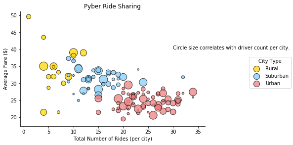
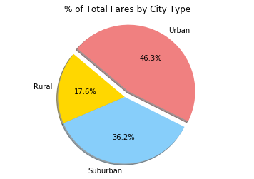
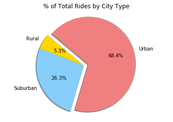
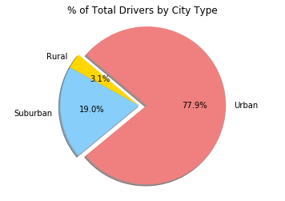

```python
# Dependencies
import pandas as pd
import matplotlib.pyplot as plt
import numpy as np
import seaborn as sns

%matplotlib inline
```


```python
# Read csv
pyber_city = pd.read_csv("raw_data/city_data.csv")

pyber_data = pd.read_csv("raw_data/ride_data.csv")
```


```python
# finding the driver count and city type
pyber_city.head()
```


<div>
<style>
    .dataframe thead tr:only-child th {
        text-align: right;
    }

    .dataframe thead th {
        text-align: left;
    }

    .dataframe tbody tr th {
        vertical-align: top;
    }
</style>
<table border="1" class="dataframe">
  <thead>
    <tr style="text-align: right;">
      <th></th>
      <th>city</th>
      <th>driver_count</th>
      <th>type</th>
    </tr>
  </thead>
  <tbody>
    <tr>
      <th>0</th>
      <td>Kelseyland</td>
      <td>63</td>
      <td>Urban</td>
    </tr>
    <tr>
      <th>1</th>
      <td>Nguyenbury</td>
      <td>8</td>
      <td>Urban</td>
    </tr>
    <tr>
      <th>2</th>
      <td>East Douglas</td>
      <td>12</td>
      <td>Urban</td>
    </tr>
    <tr>
      <th>3</th>
      <td>West Dawnfurt</td>
      <td>34</td>
      <td>Urban</td>
    </tr>
    <tr>
      <th>4</th>
      <td>Rodriguezburgh</td>
      <td>52</td>
      <td>Urban</td>
    </tr>
  </tbody>
</table>
</div>


```python
# find the total number of rides in each city
number_rides = pyber_data.groupby("city")
number_rides_cities = number_rides["ride_id"].nunique()
number_rides_cities.head()
```


    city
    Alvarezhaven    31
    Alyssaberg      26
    Anitamouth       9
    Antoniomouth    22
    Aprilchester    19
    Name: ride_id, dtype: int64


```python
# Creating a dataframe with the following criteria
# Average Fare ($) Per City
# Total Number of Rides Per City
# Total Number of Drivers Per City
# City Type (Urban, Suburban, Rural)

combined_data = pd.merge(pyber_city, pyber_data, how='outer', on='city')
combined_data.groupby('city').agg({"driver_count": "first", "fare":'mean'})

bubble_plot = combined_data.groupby('city').agg({"driver_count": "first", "type":"first", "fare":'mean'})
bubble_plot=bubble_plot.rename(columns={"driver_count":"Driver Count", "type": "City Type", "fare":"Average Fare"})

bubble_plot["Number of Rides"] = number_rides_cities

bubble_plot
```


<div>
<style>
    .dataframe thead tr:only-child th {
        text-align: right;
    }

    .dataframe thead th {
        text-align: left;
    }

    .dataframe tbody tr th {
        vertical-align: top;
    }
</style>
<table border="1" class="dataframe">
  <thead>
    <tr style="text-align: right;">
      <th></th>
      <th>Driver Count</th>
      <th>City Type</th>
      <th>Average Fare</th>
      <th>Number of Rides</th>
    </tr>
    <tr>
      <th>city</th>
      <th></th>
      <th></th>
      <th></th>
      <th></th>
    </tr>
  </thead>
  <tbody>
    <tr>
      <th>Alvarezhaven</th>
      <td>21</td>
      <td>Urban</td>
      <td>23.928710</td>
      <td>31</td>
    </tr>
    <tr>
      <th>Alyssaberg</th>
      <td>67</td>
      <td>Urban</td>
      <td>20.609615</td>
      <td>26</td>
    </tr>
    <tr>
      <th>Anitamouth</th>
      <td>16</td>
      <td>Suburban</td>
      <td>37.315556</td>
      <td>9</td>
    </tr>
    <tr>
      <th>Antoniomouth</th>
      <td>21</td>
      <td>Urban</td>
      <td>23.625000</td>
      <td>22</td>
    </tr>
    <tr>
      <th>Aprilchester</th>
      <td>49</td>
      <td>Urban</td>
      <td>21.981579</td>
      <td>19</td>
    </tr>
    <tr>
      <th>Arnoldview</th>
      <td>41</td>
      <td>Urban</td>
      <td>25.106452</td>
      <td>31</td>
    </tr>
    <tr>
      <th>Campbellport</th>
      <td>26</td>
      <td>Suburban</td>
      <td>33.711333</td>
      <td>15</td>
    </tr>
    <tr>
      <th>Carrollbury</th>
      <td>4</td>
      <td>Suburban</td>
      <td>36.606000</td>
      <td>10</td>
    </tr>
    <tr>
      <th>Carrollfort</th>
      <td>55</td>
      <td>Urban</td>
      <td>25.395517</td>
      <td>29</td>
    </tr>
    <tr>
      <th>Clarkstad</th>
      <td>21</td>
      <td>Suburban</td>
      <td>31.051667</td>
      <td>12</td>
    </tr>
    <tr>
      <th>Conwaymouth</th>
      <td>18</td>
      <td>Suburban</td>
      <td>34.591818</td>
      <td>11</td>
    </tr>
    <tr>
      <th>Davidtown</th>
      <td>73</td>
      <td>Urban</td>
      <td>22.978095</td>
      <td>21</td>
    </tr>
    <tr>
      <th>Davistown</th>
      <td>25</td>
      <td>Urban</td>
      <td>21.497200</td>
      <td>25</td>
    </tr>
    <tr>
      <th>East Cherylfurt</th>
      <td>9</td>
      <td>Suburban</td>
      <td>31.416154</td>
      <td>13</td>
    </tr>
    <tr>
      <th>East Douglas</th>
      <td>12</td>
      <td>Urban</td>
      <td>26.169091</td>
      <td>22</td>
    </tr>
    <tr>
      <th>East Erin</th>
      <td>43</td>
      <td>Urban</td>
      <td>24.478214</td>
      <td>28</td>
    </tr>
    <tr>
      <th>East Jenniferchester</th>
      <td>22</td>
      <td>Suburban</td>
      <td>32.599474</td>
      <td>19</td>
    </tr>
    <tr>
      <th>East Leslie</th>
      <td>9</td>
      <td>Rural</td>
      <td>33.660909</td>
      <td>11</td>
    </tr>
    <tr>
      <th>East Stephen</th>
      <td>6</td>
      <td>Rural</td>
      <td>39.053000</td>
      <td>10</td>
    </tr>
    <tr>
      <th>East Troybury</th>
      <td>3</td>
      <td>Rural</td>
      <td>33.244286</td>
      <td>7</td>
    </tr>
    <tr>
      <th>Edwardsbury</th>
      <td>11</td>
      <td>Urban</td>
      <td>26.876667</td>
      <td>27</td>
    </tr>
    <tr>
      <th>Erikport</th>
      <td>3</td>
      <td>Rural</td>
      <td>30.043750</td>
      <td>8</td>
    </tr>
    <tr>
      <th>Eriktown</th>
      <td>15</td>
      <td>Urban</td>
      <td>25.478947</td>
      <td>19</td>
    </tr>
    <tr>
      <th>Floresberg</th>
      <td>7</td>
      <td>Suburban</td>
      <td>32.310000</td>
      <td>10</td>
    </tr>
    <tr>
      <th>Fosterside</th>
      <td>69</td>
      <td>Urban</td>
      <td>23.034583</td>
      <td>24</td>
    </tr>
    <tr>
      <th>Hernandezshire</th>
      <td>10</td>
      <td>Rural</td>
      <td>32.002222</td>
      <td>9</td>
    </tr>
    <tr>
      <th>Horneland</th>
      <td>8</td>
      <td>Rural</td>
      <td>21.482500</td>
      <td>4</td>
    </tr>
    <tr>
      <th>Jacksonfort</th>
      <td>6</td>
      <td>Rural</td>
      <td>32.006667</td>
      <td>6</td>
    </tr>
    <tr>
      <th>Jacobfort</th>
      <td>52</td>
      <td>Urban</td>
      <td>24.779355</td>
      <td>31</td>
    </tr>
    <tr>
      <th>Jasonfort</th>
      <td>25</td>
      <td>Suburban</td>
      <td>27.831667</td>
      <td>12</td>
    </tr>
    <tr>
      <th>...</th>
      <td>...</td>
      <td>...</td>
      <td>...</td>
      <td>...</td>
    </tr>
    <tr>
      <th>South Roy</th>
      <td>35</td>
      <td>Urban</td>
      <td>26.031364</td>
      <td>22</td>
    </tr>
    <tr>
      <th>South Shannonborough</th>
      <td>9</td>
      <td>Suburban</td>
      <td>26.516667</td>
      <td>15</td>
    </tr>
    <tr>
      <th>Spencertown</th>
      <td>68</td>
      <td>Urban</td>
      <td>23.681154</td>
      <td>26</td>
    </tr>
    <tr>
      <th>Stevensport</th>
      <td>6</td>
      <td>Rural</td>
      <td>31.948000</td>
      <td>5</td>
    </tr>
    <tr>
      <th>Stewartview</th>
      <td>49</td>
      <td>Urban</td>
      <td>21.614000</td>
      <td>30</td>
    </tr>
    <tr>
      <th>Swansonbury</th>
      <td>64</td>
      <td>Urban</td>
      <td>27.464706</td>
      <td>34</td>
    </tr>
    <tr>
      <th>Thomastown</th>
      <td>1</td>
      <td>Suburban</td>
      <td>30.308333</td>
      <td>24</td>
    </tr>
    <tr>
      <th>Tiffanyton</th>
      <td>21</td>
      <td>Suburban</td>
      <td>28.510000</td>
      <td>13</td>
    </tr>
    <tr>
      <th>Torresshire</th>
      <td>70</td>
      <td>Urban</td>
      <td>24.207308</td>
      <td>26</td>
    </tr>
    <tr>
      <th>Travisville</th>
      <td>37</td>
      <td>Urban</td>
      <td>27.220870</td>
      <td>23</td>
    </tr>
    <tr>
      <th>Vickimouth</th>
      <td>13</td>
      <td>Urban</td>
      <td>21.474667</td>
      <td>15</td>
    </tr>
    <tr>
      <th>Webstertown</th>
      <td>26</td>
      <td>Suburban</td>
      <td>29.721250</td>
      <td>16</td>
    </tr>
    <tr>
      <th>West Alexis</th>
      <td>47</td>
      <td>Urban</td>
      <td>19.523000</td>
      <td>20</td>
    </tr>
    <tr>
      <th>West Brandy</th>
      <td>12</td>
      <td>Urban</td>
      <td>24.157667</td>
      <td>30</td>
    </tr>
    <tr>
      <th>West Brittanyton</th>
      <td>9</td>
      <td>Urban</td>
      <td>25.436250</td>
      <td>24</td>
    </tr>
    <tr>
      <th>West Dawnfurt</th>
      <td>34</td>
      <td>Urban</td>
      <td>22.330345</td>
      <td>29</td>
    </tr>
    <tr>
      <th>West Evan</th>
      <td>4</td>
      <td>Suburban</td>
      <td>27.013333</td>
      <td>12</td>
    </tr>
    <tr>
      <th>West Jefferyfurt</th>
      <td>65</td>
      <td>Urban</td>
      <td>21.072857</td>
      <td>21</td>
    </tr>
    <tr>
      <th>West Kevintown</th>
      <td>5</td>
      <td>Rural</td>
      <td>21.528571</td>
      <td>7</td>
    </tr>
    <tr>
      <th>West Oscar</th>
      <td>11</td>
      <td>Urban</td>
      <td>24.280000</td>
      <td>29</td>
    </tr>
    <tr>
      <th>West Pamelaborough</th>
      <td>27</td>
      <td>Suburban</td>
      <td>33.799286</td>
      <td>14</td>
    </tr>
    <tr>
      <th>West Paulport</th>
      <td>5</td>
      <td>Suburban</td>
      <td>33.278235</td>
      <td>17</td>
    </tr>
    <tr>
      <th>West Peter</th>
      <td>61</td>
      <td>Urban</td>
      <td>24.875484</td>
      <td>31</td>
    </tr>
    <tr>
      <th>West Sydneyhaven</th>
      <td>70</td>
      <td>Urban</td>
      <td>22.368333</td>
      <td>18</td>
    </tr>
    <tr>
      <th>West Tony</th>
      <td>17</td>
      <td>Suburban</td>
      <td>29.609474</td>
      <td>19</td>
    </tr>
    <tr>
      <th>Williamchester</th>
      <td>26</td>
      <td>Suburban</td>
      <td>34.278182</td>
      <td>11</td>
    </tr>
    <tr>
      <th>Williamshire</th>
      <td>70</td>
      <td>Urban</td>
      <td>26.990323</td>
      <td>31</td>
    </tr>
    <tr>
      <th>Wiseborough</th>
      <td>55</td>
      <td>Urban</td>
      <td>22.676842</td>
      <td>19</td>
    </tr>
    <tr>
      <th>Yolandafurt</th>
      <td>7</td>
      <td>Urban</td>
      <td>27.205500</td>
      <td>20</td>
    </tr>
    <tr>
      <th>Zimmermanmouth</th>
      <td>45</td>
      <td>Urban</td>
      <td>28.301667</td>
      <td>24</td>
    </tr>
  </tbody>
</table>
<p>125 rows × 4 columns</p>
</div>


```python
# creating a scatter plot/bubble plot
_type = ['Rural', 'Suburban', 'Urban']
colors = dict(Rural = 'gold', Suburban = 'lightskyblue', Urban= 'lightcoral')
count = bubble_plot['Driver Count']

df = bubble_plot

fg = sns.FacetGrid(data=df, hue='City Type', hue_order=_type, palette=colors, aspect=1.5, size=4)
fg.map(plt.scatter, 'Number of Rides', 'Average Fare', s= df['Driver Count']*4,edgecolors="black", alpha=0.75).add_legend(loc="best")

plt.title("Pyber Ride Sharing")
plt.xlabel("Total Number of Rides (per city)")
plt.ylabel("Average Fare ($)")

plt.text(30,40,"Circle size correlates with driver count per city.")

plt.show()
```





```python
# In addition, you will be expected to produce the following three pie charts:

pc_count = bubble_plot.groupby('City Type')
pc_count = pc_fares.sum()

pc_count.head()

# % of Total Fares by City Type
# % of Total Rides by City Type
# % of Total Drivers by City Type
```


<div>
<style>
    .dataframe thead tr:only-child th {
        text-align: right;
    }

    .dataframe thead th {
        text-align: left;
    }

    .dataframe tbody tr th {
        vertical-align: top;
    }
</style>
<table border="1" class="dataframe">
  <thead>
    <tr style="text-align: right;">
      <th></th>
      <th>Driver Count</th>
      <th>Average Fare</th>
      <th>Number of Rides</th>
    </tr>
    <tr>
      <th>City Type</th>
      <th></th>
      <th></th>
      <th></th>
    </tr>
  </thead>
  <tbody>
    <tr>
      <th>Rural</th>
      <td>104</td>
      <td>615.728572</td>
      <td>125</td>
    </tr>
    <tr>
      <th>Suburban</th>
      <td>635</td>
      <td>1268.627391</td>
      <td>625</td>
    </tr>
    <tr>
      <th>Urban</th>
      <td>2607</td>
      <td>1623.863390</td>
      <td>1625</td>
    </tr>
  </tbody>
</table>
</div>


```python
# % of Total Fares by City Type
sizes = pc_count['Average Fare']
colors = ["gold", "lightskyblue", "lightcoral"]

explode = (0, 0, 0.1)

plt.pie(sizes, explode=explode, labels=_type, colors=colors, 
        autopct="%1.1f%%", shadow=True, startangle=140)

plt.axis("equal")
plt.title("% of Total Fares by City Type")
plt.show()
```





```python
# % of Total Rides by City Type
sizes = pc_count['Number of Rides']
colors = ["gold", "lightskyblue", "lightcoral"]

explode = (0, 0, 0.1)

plt.pie(sizes, explode=explode, labels=_type, colors=colors, 
        autopct="%1.1f%%", shadow=True, startangle=140)

plt.axis("equal")
plt.title("% of Total Rides by City Type")
plt.show()
```





```python
# % of Total Drivers by City Type
sizes = pc_count['Driver Count']
colors = ["gold", "lightskyblue", "lightcoral"]

explode = (0, 0, 0.1)

plt.pie(sizes, explode=explode, labels=_type, colors=colors, 
        autopct="%1.1f%%", shadow=True, startangle=140)

plt.axis("equal")
plt.title("% of Total Drivers by City Type")
plt.show()
```





```python
# Three Observations Trends

# 1. Urban cities have a higher percentage of total drivers than Rural and Suburban cities
# 2. Urban cities have lower fare averages than Rural and Suburban cities
# 3. The average fare ($) decreases as the total number of rides (per city) increases
```
